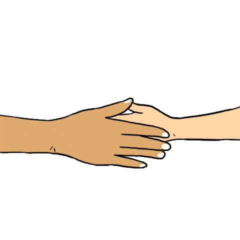

  

<h1 align="center">
  
</h1>

 

    
<h2>  Briefly About Your Girl 👧 </h2>

    
 Software Engineer  from South Africa.

    
    <h3>   I Know You Want To Know A Little More🧐 </h3>
    <ul>
        <li><a>&nbsp;I’m a Software Engineering graduate 🧑‍🎓, eager to explore new opportunities to make an impact. I thrive at the exciting crossroads of technology and creativity.</a></li> 
        <li><a>&nbsp;I'm driven by a love for solving problems. I’ve always found myself at the intersection of connecting people and working alongside businesses. My mission is simple – to bridge connections, empower collaboration, and tackle challenges that genuinely make a difference.</a></li> 
       <li><a>&nbsp; I enjoy writing documentation because I believe it's just as important as the code itself. It's like telling the story of how the code works and what it can do. I always strive to make documentation clear, concise, and useful..</a></li> 
        <li><a>&nbsp; My core mission is to seamlessly integrate AI with human experiences, focusing on ethics and interactivity. I also leverage AI to boost my creativity, expanding my horizons and exploring new possibilities. Ultimately, my goal is to use AI responsibly, driving positive and impactful changes in the world.</a></li> 
    </ul>
 

 

  <h2>
     Connect With Me
  </h2>

  
  
  
  <a href="https://medium.com/@karlieemoyo" target="_blank">
    

 

 

